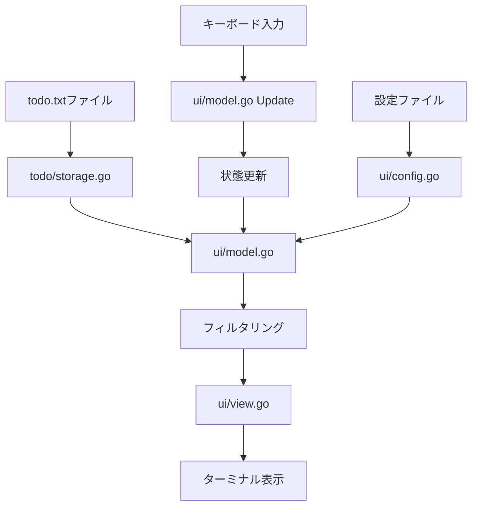
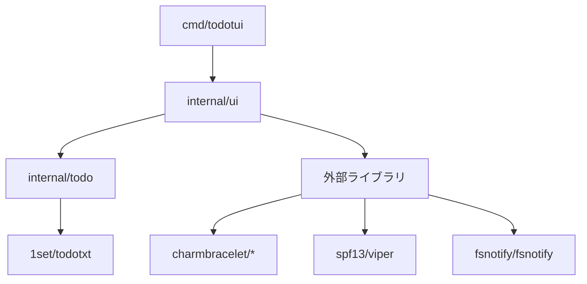

# Todo TUI - プロジェクト概要とアーキテクチャ

## プロジェクト概要

Todo TUIは、ターミナル上で動作するtodo.txt形式準拠のタスク管理ツールです。
直感的なキーボード操作とクリーンなUIを提供し、効率的なタスク管理を実現します。

### 主要な特徴

- **todo.txt形式完全準拠**: 既存のtodo.txtファイルとの完全互換性
- **TUIインターフェース**: Bubble Teaフレームワークを使用したモダンなターミナルUI
- **日本語入力サポート**: IME対応による完全な日本語入力支援
- **柔軟なフィルタリング**: プロジェクト、コンテキスト、日付、優先度による絞り込み機能
- **テーマシステム**: 複数のカラーテーマ対応
- **ファイル監視**: 外部でのファイル変更を自動検知・反映

## システムアーキテクチャ

### 全体構成

```
todotui/
├── cmd/todotui/          # エントリーポイント
│   └── main.go           # CLI インターフェース実装
├── internal/
│   ├── ui/               # ユーザーインターフェース層
│   │   ├── model.go      # メインアプリケーションロジック
│   │   ├── view.go       # ビューレンダリング
│   │   ├── types.go      # 型定義
│   │   ├── config.go     # 設定管理
│   │   ├── filters.go    # フィルタリング機能
│   │   ├── colors.go     # テーマ・カラー管理
│   │   └── ime_helper.go # 日本語入力支援
│   └── todo/             # データモデル層
│       └── storage.go    # ファイル入出力
└── docs/                 # ドキュメント
```

### アーキテクチャパターン

**Model-View-Update (MVU) パターン**
- Bubble Teaフレームワークのアーキテクチャに従い、MVUパターンを採用
- Model: アプリケーション状態管理
- View: UI表示ロジック
- Update: イベント処理とステート更新

### レイヤー構成

1. **プレゼンテーション層** (`internal/ui/`)
   - ユーザーインターフェース
   - キーボード入力ハンドリング
   - 画面レンダリング

2. **ビジネスロジック層** (`internal/ui/filters.go`, `model.go`)
   - タスクフィルタリング
   - アプリケーション状態管理
   - イベント処理

3. **データアクセス層** (`internal/todo/`)
   - ファイル入出力
   - todo.txt形式の解析・生成

## 技術スタック

### 主要ライブラリ

| ライブラリ | 用途 | バージョン |
|------------|------|------------|
| [Bubble Tea](https://github.com/charmbracelet/bubbletea) | TUIフレームワーク | v1.3.5 |
| [Lipgloss](https://github.com/charmbracelet/lipgloss) | スタイリング | v1.1.0 |
| [Bubbles](https://github.com/charmbracelet/bubbles) | UIコンポーネント | v0.21.0 |
| [1set/todotxt](https://github.com/1set/todotxt) | todo.txt解析 | v0.0.4 |
| [Viper](https://github.com/spf13/viper) | 設定管理 | v1.20.1 |
| [fsnotify](https://github.com/fsnotify/fsnotify) | ファイル監視 | v1.9.0 |

### 開発環境要件

- **Go 1.24+**: 最新のGo言語機能を活用
- **カラー対応ターミナル**: 256色またはTrueColor対応
- **Unix系OS**: macOS、Linux環境での動作確認済み

## データフロー



## モジュール間の依存関係



## 拡張性について

### プラグイン設計
- フィルタリング機能は関数型で実装され、新しいフィルタの追加が容易
- テーマシステムは設定ベースで新しいテーマを簡単に追加可能
- IMEサポートは抽象化されており、他の入力方式にも対応可能

### 将来の拡張予定
- カスタムフィルタ定義機能
- 複数ファイル対応
- 同期機能（クラウドストレージ連携）
- プラグインシステム 