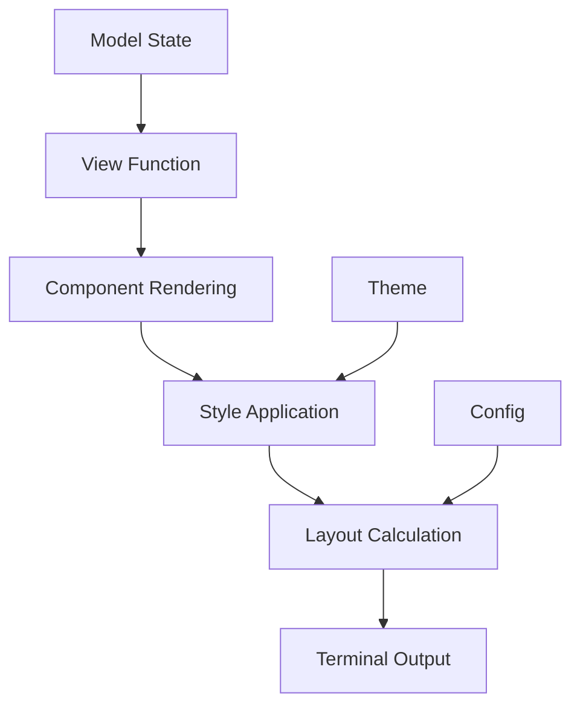

# Todo TUI - UIコンポーネント設計

## 1. 全体レイアウト設計

### 1.1 画面構成

```
┌─────────────────────────────────────────────────────────────┐
│ Todo TUI - ~/todo.txt                                       │
├─────────────────────────────────────────────────────────────┤
│                                                             │
│ ┌─────────────┐ ┌─────────────────────────────────────────┐ │
│ │   フィルタ    │ │            タスクリスト                │ │
│ │   ペイン     │ │                                       │ │
│ │             │ │                                       │ │
│ │ > すべて (23) │ │ (A) Call Mom @phone +family           │ │
│ │   未完了 (15) │ │ □ Buy milk @store +groceries          │ │
│ │   完了済み(8) │ │ ✓ Clean garage @home +chores          │ │
│ │   優先度付き  │ │ (B) Meeting prep @office +work        │ │
│ │   +project    │ │                                       │ │
│ │   @context    │ │                                       │ │
│ │   期限        │ │                                       │ │
│ │             │ │                                       │ │
│ └─────────────┘ └─────────────────────────────────────────┘ │
│                                                             │
├─────────────────────────────────────────────────────────────┤
│ Tab:切替 j/k:移動 a:追加 e:編集 d:削除 q:終了                 │
└─────────────────────────────────────────────────────────────┘
```

### 1.2 レスポンシブ設計

#### 最小画面サイズ
- **幅**: 80文字
- **高さ**: 24行
- **左ペイン最小幅**: 18文字
- **右ペイン最小幅**: 28文字

#### 画面サイズ適応
```go
type LayoutConfig struct {
    LeftPaneRatio     float64  // 左ペインの幅比率 (0.0-1.0)
    MinLeftPaneWidth  int      // 左ペイン最小幅
    MinRightPaneWidth int      // 右ペイン最小幅
    VerticalPadding   int      // 垂直方向のパディング
}
```

## 2. コンポーネント設計

### 2.1 フィルタペイン (`FilterPane`)

#### 構造
```go
type FilterPane struct {
    items       []FilterItem
    selected    int
    focused     bool
    style       FilterStyle
}

type FilterItem struct {
    name        string
    count       int
    filterFunc  func(TaskList) TaskList
    active      bool
}
```

#### 表示スタイル
```
┌─────────────┐
│ フィルタ      │
├─────────────┤
│ > すべて (23) │  ← アクティブ (強調表示)
│   未完了 (15) │  ← 通常項目
│   完了済み(8) │
│   優先度付き  │
│             │
│ プロジェクト   │  ← セクション見出し
│ > +work (5)  │  ← プロジェクトフィルタ
│   +family    │
│             │
│ コンテキスト   │
│ > @home (3)  │
│   @office    │
└─────────────┘
```

#### 状態管理
- **選択状態**: カーソル位置とハイライト
- **アクティブフィルタ**: 現在適用中のフィルタ
- **カウント更新**: タスク変更時の自動更新

### 2.2 タスクペイン (`TaskPane`)

#### 構造
```go
type TaskPane struct {
    tasks       []TaskItem
    filtered    []TaskItem
    selected    int
    focused     bool
    style       TaskStyle
}

type TaskItem struct {
    task        *todotxt.Task
    displayText string
    style       lipgloss.Style
}
```

#### タスク表示形式
```
┌─────────────────────────────────────────┐
│ タスクリスト                              │
├─────────────────────────────────────────┤
│ (A) Call Mom @phone +family due:今日     │ ← 優先度A (赤色)
│ □ Buy milk @store +groceries            │ ← 未完了 (通常色)
│ ✓ Clean garage @home +chores            │ ← 完了 (グレー)
│ (B) Meeting prep @office +work          │ ← 優先度B (黄色)
│ □ Review documents due:明日              │ ← 期限付き
│                                         │
│ 表示: 5/23 タスク                        │ ← ステータス
└─────────────────────────────────────────┘
```

#### 色分けルール
- **優先度A**: 赤色系 (`#ff6b6b`)
- **優先度B**: 黄色系 (`#ffd93d`)
- **優先度C**: 青色系 (`#6bcf7f`)
- **優先度D**: 紫色系 (`#a78bfa`)
- **完了タスク**: グレー系 (`#6b7280`)
- **期限切れ**: 背景赤色

### 2.3 モーダルダイアログ

#### タスク編集ダイアログ
```
┌─────────────────────────────────────────┐
│ タスクを編集                              │
├─────────────────────────────────────────┤
│                                         │
│ ┌─────────────────────────────────────┐ │
│ │ Call Mom @phone +family             │ │ ← テキスト入力エリア
│ │                                     │ │
│ └─────────────────────────────────────┘ │
│                                         │
│ Enter: 保存  Esc: キャンセル               │
└─────────────────────────────────────────┘
```

#### 削除確認ダイアログ
```
┌─────────────────────────────────────────┐
│ 削除の確認                                │
├─────────────────────────────────────────┤
│                                         │
│ 以下のタスクを削除しますか？                 │
│                                         │
│ "Buy milk @store +groceries"            │
│                                         │
│     [はい(y)]     [いいえ(n)]            │
└─────────────────────────────────────────┘
```

## 3. テーマシステム

### 3.1 テーマ構造

```go
type Theme struct {
    Name        string
    Background  lipgloss.Color
    Foreground  lipgloss.Color
    Primary     lipgloss.Color
    Secondary   lipgloss.Color
    Accent      lipgloss.Color
    Success     lipgloss.Color
    Warning     lipgloss.Color
    Error       lipgloss.Color
    
    // 優先度カラー
    PriorityA   lipgloss.Color
    PriorityB   lipgloss.Color
    PriorityC   lipgloss.Color
    PriorityD   lipgloss.Color
    
    // 状態カラー
    Completed   lipgloss.Color
    Overdue     lipgloss.Color
    
    // UI要素
    Border      lipgloss.Color
    Selected    lipgloss.Color
    Dimmed      lipgloss.Color
}
```

### 3.2 利用可能テーマ

#### Catppuccin テーマ
```yaml
name: catppuccin
background: "#1e1e2e"
foreground: "#cdd6f4" 
primary: "#89b4fa"
secondary: "#f38ba8"
accent: "#a6e3a1"
priority_a: "#f38ba8"  # Red
priority_b: "#f9e2af"  # Yellow
priority_c: "#a6e3a1"  # Green
priority_d: "#cba6f7"  # Purple
```

#### Nord テーマ
```yaml
name: nord
background: "#2e3440"
foreground: "#d8dee9"
primary: "#88c0d0"
secondary: "#81a1c1"
accent: "#a3be8c"
priority_a: "#bf616a"  # Red
priority_b: "#ebcb8b"  # Yellow
priority_c: "#a3be8c"  # Green
priority_d: "#b48ead"  # Purple
```

## 4. 入力システム

### 4.1 キーバインディング設計

#### グローバルキー
```go
type GlobalKeyMap struct {
    Quit           key.Binding  // q
    SwitchPane     key.Binding  // Tab
    MoveLeft       key.Binding  // h
    MoveRight      key.Binding  // l
}
```

#### リスト操作キー
```go
type ListKeyMap struct {
    Up             key.Binding  // j, ↑
    Down           key.Binding  // k, ↓
    Select         key.Binding  // Enter
    Home           key.Binding  // Home
    End            key.Binding  // End
}
```

#### タスク操作キー
```go
type TaskKeyMap struct {
    Add            key.Binding  // a
    Edit           key.Binding  // e
    Delete         key.Binding  // d
    TogglePriority key.Binding  // p
    Restore        key.Binding  // r
}
```

### 4.2 IME統合

#### IMEHelper構造
```go
type IMEHelper struct {
    enabled      bool
    localeSet    bool
    originalLang string
    originalLC   string
}

func (ime *IMEHelper) Enable() error {
    // IME環境の設定
    if err := ime.setLocaleEnvironment(); err != nil {
        return err
    }
    ime.enabled = true
    return nil
}
```

#### 日本語入力フロー
1. **入力モード開始**: 環境変数設定
2. **テキスト入力**: UTF-8バイト列の適切な処理
3. **変換処理**: IMEによる文字変換
4. **確定処理**: 完成した文字列の取得
5. **クリーンアップ**: 環境復元

## 5. レンダリングシステム

### 5.1 描画パイプライン



### 5.2 パフォーマンス最適化

#### 差分レンダリング
- **変更検出**: 前回レンダリング結果との比較
- **部分更新**: 変更箇所のみ再描画
- **キャッシュ**: 計算済みスタイルの保持

#### メモリ管理
```go
type RenderCache struct {
    lastModel    Model
    lastView     string
    styleCache   map[string]lipgloss.Style
    layoutCache  map[string]LayoutInfo
}
```

## 6. アクセシビリティ

### 6.1 視覚的配慮

#### カラーブラインド対応
- **高コントラスト**: WCAG 2.1 AA準拠
- **色以外の情報**: 記号やパターンによる状態表示
- **代替表現**: テキストによる状態説明

#### 画面読み上げ対応
- **代替テキスト**: 各UI要素の説明
- **構造化情報**: 見出しレベルの適切な設定
- **フォーカス管理**: 論理的なタブ順序

### 6.2 操作性配慮

#### キーボード操作
- **すべての機能**: マウス不要での完全操作
- **ショートカット**: 効率的なキー組み合わせ
- **ヘルプ**: `?`キーでのヘルプ表示

#### 設定の柔軟性
- **文字サイズ**: ターミナル設定による調整
- **色彩調整**: テーマによる色合い変更
- **動作速度**: レスポンス設定の調整 